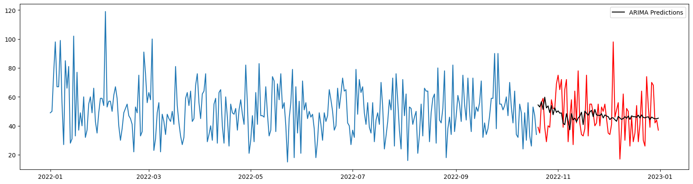
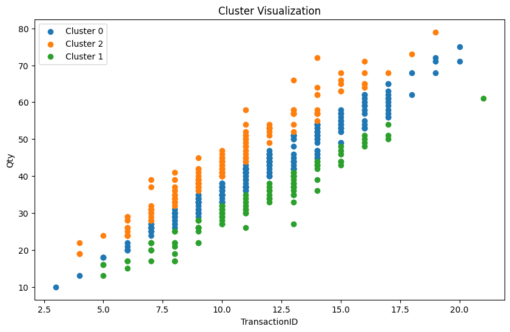

# Time Series Prediction and Segmentation-Customer

## Purpose

<ul>
<li>To predict the number of sales (quantity) of the total number of food products</li>
<li>Predictions must be made daily</li>
<li>Create a customer cluster/segment based on several criteria. This will be used to personalized promotion and sales treatment for the marketing team
</ul>

## Datasets

This dataset consists of 4 CSV files, there are:

1. Customers
2. Product
3. Store
4. Transaction

This is dummy data for an FMCG case study over a period of 1 year taken through the membership program.

## Data Modelling

1. <strong>ARIMA Model</strong>: The purpose of making this machine learning model is to be able to predict the total daily quantity of products sold
2. <strong>Clustering Model with K-Means</strong>: The aim of creating this machine learning model is to be able to create clusters of similar customers

## Results

1. ARIMA predictions show the daily quantity required is around 50-60
   
2. Within the 3 clusters, cluster 0 has the most customers with an average quantity of 42 and average transaction of 11
   
